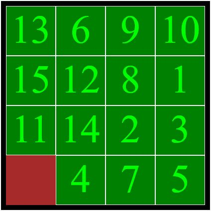

# Slide Puzzle

A sliding puzzle game which is played by moving the pieces by clicking on them and arranging them in the order.

[Github pages link to the game](https://sukhpreet-s.github.io/slide-puzzle-game-js/index.html)



## Getting Started

To start playing, just open index.html file in any browser, prefered ones:

```
Chrome, Firefox
```

## Built With

- HTML, CSS, JavaScript
- [TweenMax](https://greensock.com/tweenmax) - JavaScript animation library used

## Authors

- [**Sukhpreet Singh**](https://github.com/Sukhpreet-s) _(Myself)_ - implemented the functionality of the game
- [**Albert Villaruz**](https://github.com/avcoder) _(My Teacher)_ - provided the template to work with
